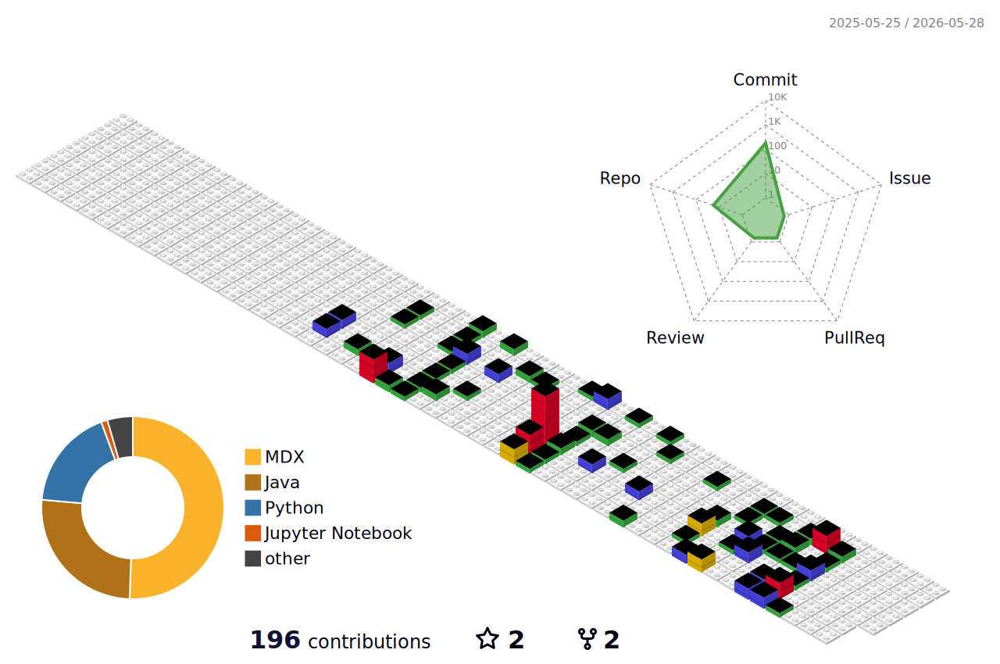

<p align="center">
  
</p>

<p align="center">
  
</p>

```text
┌────────────────────────────────────────────────────────────────────┐
│ FILE        KEVIN258258 / PROFILE README                          │
│ VIEW        3D activity / live metrics / string labels            │
│ SIGNAL      machine learning / mathematics / systems              │
│ NODE        tensorfieldx.space                                    │
│ HANDLE      @kevin258258                                          │
└────────────────────────────────────────────────────────────────────┘
```

<p align="center">
  
</p>

<p align="center">
  
</p>

```text
[ AXIS_01 ] notebooks / long-form notes / technical fragments
[ AXIS_02 ] model reproductions / selected repositories / durable archives
[ AXIS_03 ] high signal / low ornament / data-backed activity view
```

```text
[ LINK ]
site   -> https://tensorfieldx.space
alias  -> hollow-stone
mode   -> build quietly / keep structure visible
```
