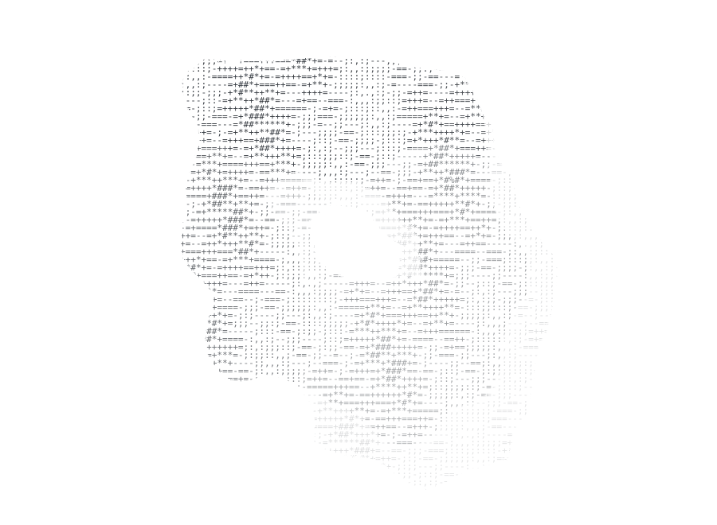

<picture>
  <source media="(prefers-color-scheme: dark)" srcset="assets/hollow-stone-dark.svg">
  <source media="(prefers-color-scheme: light)" srcset="assets/hollow-stone-light.svg">
  
</picture>
